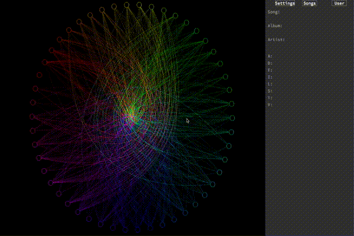

# ReND

ReND stands for Radial Node Diagram, which is the kind of graph that inspired the design of this program's main display.
This project started out as a quick practice for me to use a REST API in python (specifically Spotify's; big music nerd), and it kind of sparked my interest in data analysis.
I wanted to create something that would
  A) Challenge my ability to manage data
  B) Challenge my ability with a limited graphics library
  C) Make something that looks visually appealing
  
While I'm proud of what I have so far in this limited project, I want to expand on this later. If you want to use any of this code, or have any questions, go ahead!
